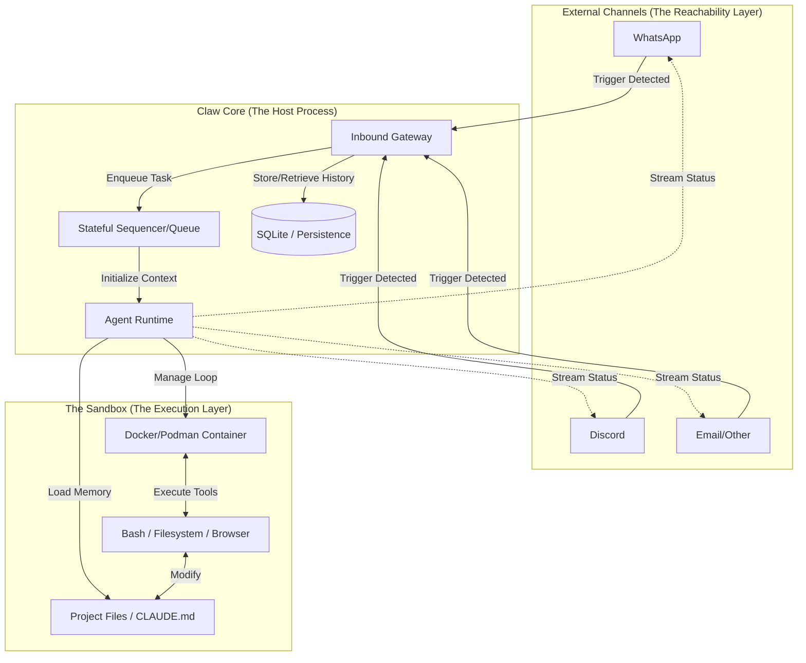

# Claw Core: Architectural Principles & Component Requirements

This document outlines the foundational principles and architectural components that define a "Claw Core" system (based on the analysis of `openclaw` and `nanoclaw`).

---

## 1. High-Level Architecture

## 2. Core Principles

A robust Claw Core is built on four pillars that move it beyond a simple chatbot into a functional autonomous agent.

### I. Isolation (The Sandbox Principle)
*   **Definition**: The agent must never execute code directly on the host system.
*   **Requirement**: All tool executions (Bash, Filesystem, Browser) must occur within an isolated container (Docker, Podman, or similar).
*   **Goal**: Protect host credentials, sensitive data, and system stability from potentially destructive or hallucinated agent actions.

### II. Persistence (The Memory Principle)
*   **Definition**: The agent must maintain state across long durations and multiple sessions.
*   **Requirement**: 
    *   **Hierarchical Memory**: Support for Global memory (general facts) and Local memory (project/chat-specific context).
    *   **Automated Compaction**: A mechanism to summarize or prune conversation history to keep the agent within LLM context limits without losing the "thread" of the task.
*   **Goal**: Create a sense of continuity where the agent "knows" who you are and what you're working on.

### III. Reachability (The Multi-Channel Principle)
*   **Definition**: The agent should exist where the user is already working.
*   **Requirement**: The core must be protocol-agnostic. It should normalize input from WhatsApp, Discord, Slack, or TUI into a standard "Intent" object and handle outbound streaming back to those platforms.
*   **Goal**: Minimize friction for the user by meeting them in their preferred communication channel.

### IV. Autonomy (The Proactive Principle)
*   **Definition**: The system must be capable of acting without an immediate user trigger.
*   **Requirement**: A built-in scheduler that can trigger "Agent Runs" based on time (Cron) or events (Webhook/IPC).
*   **Goal**: Transform the agent from a reactive responder into a proactive assistant that performs background tasks (e.g., morning briefings, system monitoring).

---

## 2. Primary Architectural Components

### A. The Inbound Gateway (The Message Loop)
The "Ear" of the system. Its primary responsibility is normalization.
*   **Requirements**:
    *   **Trigger Detection**: Identify when a message is directed at the agent (e.g., regex matching `@Assistant`).
    *   **Context Fetching**: Retrieve the last $N$ messages from the database to provide immediate history.
    *   **Concurrency Control**: Implement a "Group Queue" to ensure that a single session only processes one message at a time to prevent state corruption.

### B. The Agent Runtime (The Brain)
The orchestrator of the "Thought Loop."
*   **Requirements**:
    *   **Prompt Assembly**: Dynamically build the system prompt by merging Global/Local memory files (`CLAUDE.md`) with the current conversation.
    *   **Streaming IPC**: Handle the delta-stream from the LLM and route it to the user in real-time.
    *   **Tool Dispatcher**: Intercept "tool_use" calls from the LLM, validate permissions, and route them to the Sandbox.

### C. The Execution Sandbox (The Hand)
The isolated environment where the work happens.
*   **Requirements**:
    *   **Workspace Management**: Automatically mount the correct host directory (Project Folder) to the container.
    *   **Safe-Tooling**: Provide a standard set of capabilities (Bash, Read/Write File, Search) that are pre-configured to run within the container's restricted user space.
    *   **Persistence**: Ensure that files created by the agent in the container persist on the host (via Volume Mounts).

### D. The Stateful Sequencer (The Nervous System)
The logic that connects the Gateway to the Runtime.
*   **Requirements**:
    *   **Session Management**: Track "Active" vs "Idle" containers to optimize resource usage.
    *   **Compaction Trigger**: Monitor token usage and automatically invoke a "Summarization Run" when thresholds are met.
    *   **Audit Logging**: Record every tool call, input, and output for later review or debugging.

---

## 3. The Lifecycle of a "Claw Run"

1.  **Capture**: User sends a message via a Channel (e.g., WhatsApp).
2.  **Hydrate**: The Gateway pulls the last 10 messages + the group's `CLAUDE.md` file.
3.  **Queue**: The Sequencer places the request in the group's queue.
4.  **Execute**: The Runtime spawns/resumes a Sandbox container.
5.  **Loop**: The Agent uses tools in the Sandbox. The Core streams "thinking" updates back to the Channel.
6.  **Finalize**: The Agent provides a final answer. The Core saves the new conversation state and releases/idles the Sandbox.
