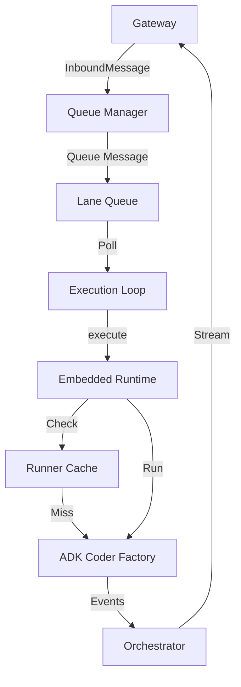

# Design Doc 005: Message Queuing and Streaming

## Status
Proposed

## Context
The current implementation of `EmbeddedRuntime` in `adk-claw` follows a "request-response" pattern at the execution level:
1.  The Gateway receives an `InboundMessage`.
2.  The Orchestrator calls `EmbeddedRuntime.execute()`.
3.  `EmbeddedRuntime` builds a fresh `Runner` (ADK Coder), runs one turn, and streams events back.

This approach has several limitations:
- **Race Conditions**: If multiple messages arrive for the same "lane" (user/channel) in quick succession, they trigger overlapping `execute()` calls. This leads to the `ValueError: last_update_time` because two runners are trying to update the same session in the database simultaneously.
- **Lost Context**: Messages arriving *while* the agent is thinking are either ignored or cause conflicts, rather than being queued for the next turn.
- **Inefficiency**: Rebuilding the `Runner` on every turn is expensive (re-parsing instructions, re-initializing tools).

## Proposed Changes

### 1. Lane-Based Message Queuing
We will introduce a **Queue Manager** that ensures only one active execution exists per `lane_id`.

- Each `lane_id` (e.g., `discord:123:456`) gets a dedicated message queue.
- When a message arrives, it is appended to the lane's queue.
- An **Execution Loop** polls the queue. If the agent is idle, it pops the next message (or a batch of pending messages) and starts a turn.
- Subsequent messages arriving during the turn stay in the queue until the current turn completes.

### 2. Persistent Runtime Sessions
Instead of rebuilding the `Runner` every time, the `EmbeddedRuntime` will attempt to maintain a "Warm Runner" for active lanes.

- A `RunnerCache` will store initialized `Runner` objects keyed by `lane_id`.
- Runners stay in cache for a configurable TTL (e.g., 10 minutes of inactivity).
- The `execute()` method will first check the cache.

### 3. Streaming Orchestration
The Orchestrator will be updated to handle "Interruption" and "Context Injection":
- If a high-priority message arrives, we should be able to signal the `Runner` to stop and incorporate the new info (future phase).
- For now, we focus on **sequential consistency**: Message A completes -> Message B starts with updated session state.

## Architecture

## Implementation Plan
1.  **Define `LaneQueue`**: A simple async queue per `lane_id`.
2.  **Update `EmbeddedRuntime`**: 
    - Restore `self._runners` cache.
    - Implement runner reuse logic.
3.  **Refactor Orchestrator**: Move from direct execution to a queued model.
4.  **Handle Session Sync**: Ensure the `Runner` is refreshed if the session state in the DB is newer than the cached runner (handling multi-host scenarios).

## References
- [OpenClaw Queue Concept](https://docs.openclaw.ai/concepts/queue)
- [OpenClaw Messages Concept](https://docs.openclaw.ai/concepts/messages)
