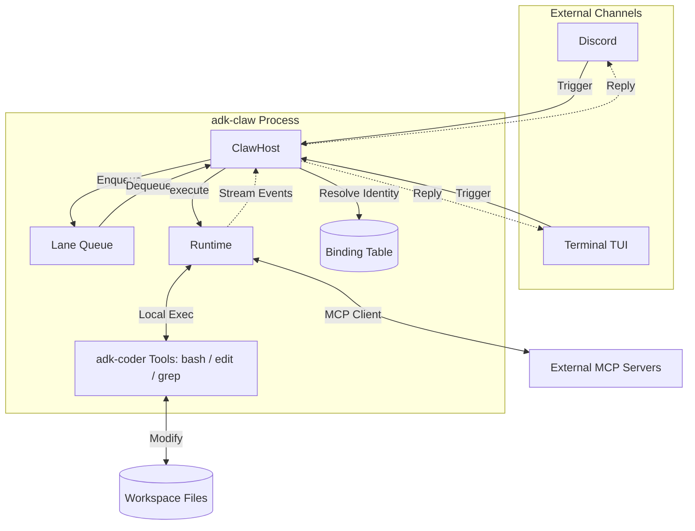

# Claw Core: Architectural Principles & Component Requirements

---

## 0. The Four Pillars

At its core, a Claw system is an event-driven, session-isolated, single-writer state machine. Everything it does reduces to four pieces:

| Pillar | What It Provides | adk-claw Implementation |
|---|---|---|
| **Time** | Heartbeats + Cron schedules that create proactive triggers | The Pulse (background scheduler) |
| **Events** | Messages + Hooks + Webhooks that drive reactive work | Inbound Gateway (multi-channel normalization) |
| **State** | Sessions + Workspace memory that persist across turns | SqliteSessionService + MemoryStore |
| **Loop** | Agent turns: _read → decide → act → write_ | Runtime (adk-coder agent loop) |

---

## 1. High-Level Architecture

### Component Responsibility

| Component | Responsibility |
|---|---|
| **ClawHost** | Config, bindings, routing, cancellation, queue (future) |
| **Runtime** | Agent execution in an isolated workspace |
| **ChannelAdapter** | Normalize channel I/O (Discord, TUI, A2A) |
| **BindingTable** | Identity → workspace resolution |

### The Runtime Protocol

The `Runtime` protocol is the key abstraction enabling multiple execution backends:

| Implementation | How | When |
|---|---|---|
| `EmbeddedRuntime` | In-process, `os.chdir()` + `build_runner()` | Single-user, single workspace |
| `SubprocessRuntime` | `asyncio.create_subprocess_exec(cwd=workspace)` | Local multi-workspace |
| `KubeJobRuntime` | K8s Job with PVC-mounted workspace | Production, multi-tenant |

---

## 2. Core Principles

### I. Isolation (The Workspace Principle)
The agent's tool executions are scoped to its assigned workspace. The `Runtime` handles CWD isolation — `EmbeddedRuntime` uses `os.chdir()`, while `KubeJobRuntime` uses container-level isolation.

### II. Persistence (The Memory Principle)
The agent maintains state across sessions via `SqliteSessionService` (conversation history) and `MemoryStore` (cross-session key-value notes). Auto-compaction keeps sessions within LLM context limits.

### III. Reachability (The Multi-Channel Principle)
The `ChannelAdapter` protocol normalizes input from Discord, CLI, or any future channel into `InboundMessage`. The core is channel-agnostic.

### IV. Autonomy (The Proactive Principle)
The Pulse scheduler triggers agent runs based on time (cron) or events (webhooks) without a user message.

---

## 3. The Lifecycle of a "Claw Run"

1.  **Capture**: User sends a message via a Channel (e.g., Discord @mention).
2.  **Normalize**: The `ChannelAdapter` routes through `ClawHost.handle_message()`.
3.  **Resolve**: The host resolves the workspace from the `BindingTable`.
4.  **Execute**: The host calls `runtime.execute()` with the workspace path and message.
5.  **Loop**: The Runtime runs the adk-coder agent. The host streams events back to the channel.
6.  **Finalize**: The agent provides a response. The session is saved. The lane is released.

---

## 4. Module Layout

| Module | Purpose |
|---|---|
| `adk_claw/host/host.py` | `ClawHost` — config, bindings, routing, cancellation |
| `adk_claw/runtime/` | `Runtime` protocol + `EmbeddedRuntime` (future: `SubprocessRuntime`, `KubeJobRuntime`) |
| `adk_claw/gateway/` | `ChannelAdapter` protocol + `DiscordAdapter` |
| `adk_claw/config.py` | YAML config loader (global + project merge) |
| `adk_claw/memory.py` | Cross-session `MemoryStore` (JSON files) |
| `adk_claw/binding/` | `BindingTable` — maps `(protocol, channel_id, author_id)` → `WorkspaceContext` |
| `adk_claw/domain/models.py` | Core domain types |
| `adk_claw/mcp/` | MCP server tools |
