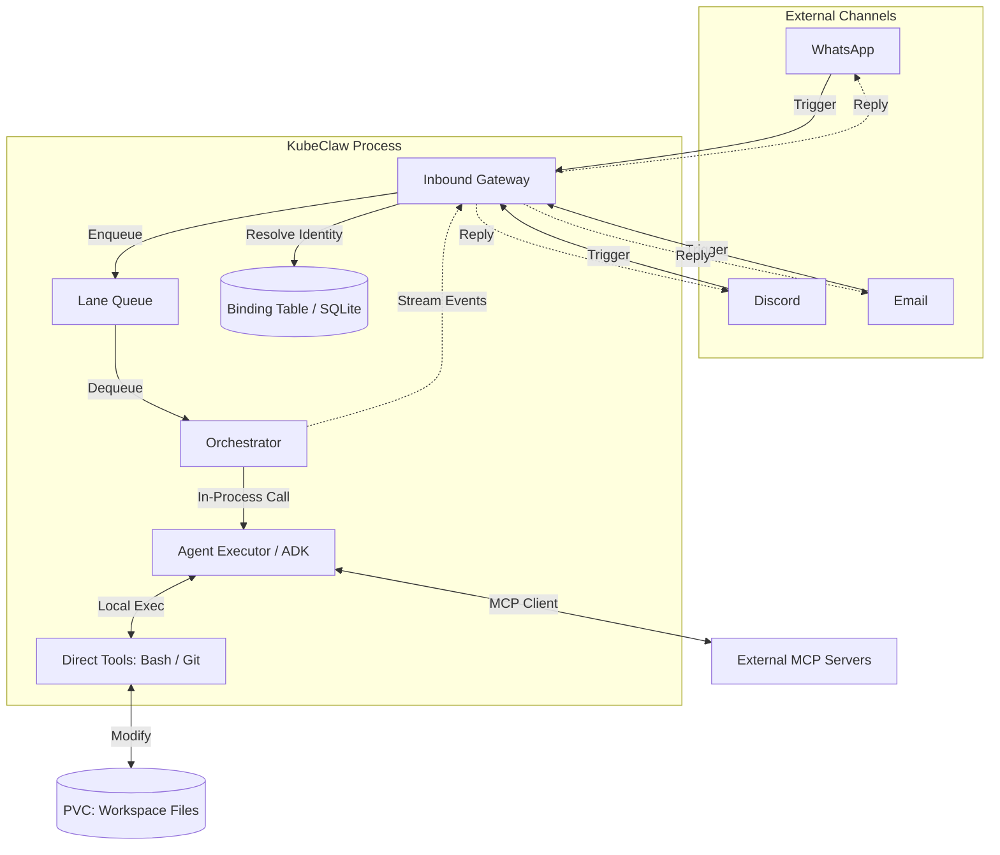

# Claw Core: Architectural Principles & Component Requirements

This document outlines the foundational principles and architectural components that define a "Claw Core" system (based on the analysis of `openclaw` and `nanoclaw`).

---

## 0. The Four Pillars

At its core, a Claw system is an event-driven, session-isolated, single-writer state machine. Everything it does reduces to four pieces:

| Pillar | What It Provides | KubeClaw Implementation |
|---|---|---|
| **Time** | Heartbeats + Cron schedules that create proactive triggers | The Pulse (background scheduler) |
| **Events** | Messages + Hooks + Webhooks that drive reactive work | Inbound Gateway (multi-channel normalization) |
| **State** | Sessions + Workspace memory that persist across turns | PVC-backed workspaces + Binding Table |
| **Loop** | Agent turns: _read → decide → act → write_ | Embedded Executor (adk-coder agent loop) |

When people ask whether agents are "alive," the real questions are: *What events wake them? What state do they own? What invariants do they enforce? What tools can they execute?*

---

## 1. High-Level Architecture

> **Embedded Executor Model** ([ADR-004](../../decisions/ADR-004-embedded-executor.md)): The Gateway, Orchestrator, and Agent Executor run in a single process. There is no container boundary, no UDS, and no inter-process protocol between them.

## 2. Protocols

### MCP (Model Context Protocol) — External Tools Only
*   **Role**: Connects the Agent Executor to *external* tool servers for API-based tools (GitHub, Slack, etc.).
*   **Transport**: stdio or HTTP (to external MCP servers)
*   **Not used internally**: There is no in-process MCP server for "hydration." Direct tools (bash, git) run as subprocesses.

### Internal Communication
*   **Gateway → Orchestrator**: `InboundMessage` (normalized input from any channel)
*   **Orchestrator → Executor**: Direct async function call
*   **Executor → Orchestrator**: `OrchestratorEvent` stream (thoughts, results, artifacts)
*   See [11-queue-concurrency.md](./11-queue-concurrency.md) for queue semantics

---

## 3. Core Principles

A robust Claw Core is built on four pillars that move it beyond a simple chatbot into a functional autonomous agent.

### I. Isolation (The Workspace Principle)
*   **Definition**: The agent's tool executions are scoped to its assigned workspace.
*   **Requirement**: All tool executions (Bash, Filesystem) operate within a PVC-mounted workspace. K8s Pod isolation provides the OS-level boundary.
*   **Goal**: Protect host credentials, sensitive data, and system stability from potentially destructive or hallucinated agent actions.

### II. Persistence (The Memory Principle)
*   **Definition**: The agent must maintain state across long durations and multiple sessions.
*   **Requirement**:
    *   **Hierarchical Memory**: Support for Global memory (general facts) and Local memory (project/chat-specific context).
    *   **Automated Compaction**: A mechanism to summarize or prune conversation history to keep the agent within LLM context limits without losing the "thread" of the task.
*   **Goal**: Create a sense of continuity where the agent "knows" who you are and what you're working on.

### III. Reachability (The Multi-Channel Principle)
*   **Definition**: The agent should exist where the user is already working.
*   **Requirement**: The core must be protocol-agnostic. It should normalize input from WhatsApp, Discord, Slack, or TUI into a standard "Intent" object and handle outbound streaming back to those platforms.
*   **Goal**: Minimize friction for the user by meeting them in their preferred communication channel.

### IV. Autonomy (The Proactive Principle)
*   **Definition**: The system must be capable of acting without an immediate user trigger.
*   **Requirement**: A built-in scheduler that can trigger "Agent Runs" based on time (Cron) or events (Webhook/IPC).
*   **Goal**: Transform the agent from a reactive responder into a proactive assistant that performs background tasks (e.g., morning briefings, system monitoring).

---

## 2. Primary Architectural Components

### A. The Inbound Gateway
Normalizes all external inputs into `InboundMessage` events.
*   **Trigger Detection**: Identify when a message is directed at the agent
*   **Dedupe & Debounce**: Prevent duplicate runs from channel redeliveries; batch rapid text messages
*   **Lane Key Resolution**: Compute `lane_key` from channel/author (see [11-queue-concurrency.md §6](./11-queue-concurrency.md))

### B. The Orchestrator
Enforces queue invariants and invokes the executor.
*   **Lane Queue**: Per-session FIFO with single-writer guarantee
*   **Global Throttle**: Semaphore capping total concurrent runs
*   **Queue Modes**: `collect` / `followup` / `steer` (see [11-queue-concurrency.md](./11-queue-concurrency.md))
*   **Context Compaction**: Monitor token usage and trigger summarization when thresholds are exceeded
*   **Audit Logging**: Record every tool call, input, and output

### C. The Agent Executor
Runs the ADK agent loop in-process.
*   **ADK Framework**: `LlmAgent` with Gemini for reasoning
*   **Workspace Loading**: Reads `AGENTS.md` from the PVC-mounted workspace for system prompt
*   **External MCP Tools**: Connects to configured external MCP servers via `McpToolset`
*   **Direct Tools**: Bash, git, and file operations run as subprocesses
*   **Event Streaming**: Yields `OrchestratorEvent` (thoughts, results, artifacts) back to the orchestrator

### D. The Binding Table
Maps external identities to workspaces and auth profiles.
*   **Identity Resolution**: `(protocol, channel_id, author_id)` → `WorkspaceContext`
*   **Auth Profile**: Scoped credentials injected as environment variables
*   **Workspace Path**: PVC mount path for the project files

---

## 3. The Lifecycle of a "Claw Run"

1.  **Capture**: User sends a message via a Channel (e.g., Discord).
2.  **Normalize**: The Gateway creates an `InboundMessage` with the resolved `lane_key`.
3.  **Queue**: The Orchestrator enqueues the message into the per-session lane.
4.  **Execute**: The Orchestrator invokes the Agent Executor in-process.
5.  **Loop**: The Agent uses tools (subprocess + external MCP). The Orchestrator streams "thinking" updates back to the Channel.
6.  **Finalize**: The Agent provides a final answer. The Orchestrator saves the conversation state and releases the lane.
